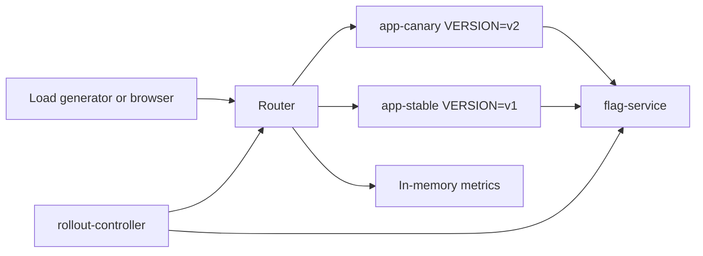

# progressive-delivery-lab

`progressive-delivery-lab` is a local Go demo for one of the most important deployment patterns in large-scale backend systems: ship code first, activate behavior later.

The demo shows how a team can deploy a new app version without scheduled downtime, send a small amount of traffic to it, turn on a feature flag for a controlled audience, watch health metrics, and automatically roll back when the canary becomes unhealthy.

## Architecture



## What This Demonstrates

Large applications usually avoid downtime by separating two concerns:

1. Deployment: putting new code into the environment.
2. Activation: deciding who can see or use a new behavior.

In this repo, `app-canary` runs `VERSION=v2` from the start, but the new fraud model is hidden until `flag-service` enables it. That means the code can be deployed and warmed up before customers see the behavior.

The router controls traffic shifting. The feature flag controls behavior. The rollout controller connects both with a health gate.

## Services

`app`

- `GET /health`
- `GET /checkout`
- `GET /fraud-check`
- `GET /metrics`

Two app containers run locally:

- `app-stable` uses `VERSION=v1`
- `app-canary` uses `VERSION=v2`

The v2 app contains the new fraud model path. It only runs when the fraud-model feature flag is enabled and the request falls inside the flag rollout percentage.

`flag-service`

- `GET /flags`
- `POST /flags/fraud-model`
- `POST /flags/fraud-model/kill`

The flag state is in memory:

```json
{
  "fraudModel": {
    "enabled": true,
    "rolloutPercent": 1
  }
}
```

`router`

- Proxies checkout traffic to stable or canary.
- Starts at 1 percent canary traffic.
- Supports `POST /rollout`.
- Supports `POST /rollback`.
- Logs every request with target, status, latency, and current canary percentage.

`rollout-controller`

- Checks health every 10 seconds.
- Promotes through `1 -> 5 -> 25 -> 50 -> 100`.
- Requires canary error rate below 2 percent.
- Requires canary p99 latency below 500 ms.
- Rolls back canary traffic to 0 percent and calls the feature kill switch if health is bad.

`loadgen`

- Sends local traffic to the router.
- Used by `make demo-good` and `make demo-bad`.

## Run It

Start the stack:

```bash
make up
```

In another terminal, watch logs:

```bash
make logs
```

Check the router:

```bash
curl -s http://localhost:18080/health
```

Check flags:

```bash
curl -s http://localhost:8081/flags
```

## Demo Flow

Start the stack:

```bash
make up
```

At this point, both stable and canary code are deployed locally. The router starts with 1 percent canary traffic, but the fraud-model flag is off, so v2 code is present without activating the new feature.

Enable the feature for 1 percent:

```bash
make enable-flag
```

Run the healthy demo:

```bash
make demo-good
```

Expected behavior:

- Traffic starts with a small canary percentage.
- The fraud model is enabled for the same small percentage.
- The controller sees canary p99 below 500 ms and error rate below 2 percent.
- The rollout advances through 5, 25, 50, and 100 percent.

Run the unhealthy demo:

```bash
make demo-bad
```

Expected behavior:

- Canary v2 starts returning worse latency and errors.
- The controller detects unhealthy canary metrics.
- Router canary traffic is rolled back to 0 percent.
- The fraud-model feature flag is killed immediately.

Manual rollback:

```bash
make rollback
```

That command does two things:

- `POST /rollback` on the router.
- `POST /flags/fraud-model/kill` on the flag service.

No redeploy is needed.

## Example Logs

Healthy promotion:

```text
promotion complete from=1 to=5 error_rate=0.0000 p99_ms=221
promotion complete from=5 to=25 error_rate=0.0000 p99_ms=234
promotion complete from=25 to=50 error_rate=0.0000 p99_ms=238
promotion complete from=50 to=100 error_rate=0.0000 p99_ms=245
health_check canary_percent=100 state=complete error_rate=0.0000 p99_ms=249
```

Unhealthy rollback:

```text
rollback triggered canary_percent=25 error_rate=0.0833 p99_ms=812
rollback complete canary_percent=0 fraud_model=disabled
health_check canary_percent=0 state=rolled_back
```

Router request log:

```text
target=canary status=200 latency_ms=238 canary_percent=25 path=/checkout
target=stable status=200 latency_ms=132 canary_percent=25 path=/checkout
```

## Why The Kill Switch Matters

A rollback changes traffic routing. A kill switch changes behavior.

If a new feature is causing harm, the fastest fix is often to disable the feature flag. That can happen even while the new code stays deployed. This is the difference between deploying code and activating product behavior.

## What This Prototype Does Not Cover

- Persistent metrics storage
- Prometheus, Grafana, or alert routing
- Distributed tracing
- Real Kubernetes rollout controllers
- Real service mesh traffic splitting
- Authentication or authorization
- Multi-region deployments
- Database migrations
- Long-lived feature flag governance

Those pieces matter in production. They are intentionally left out here so the core delivery pattern is easy to see.

## Useful Endpoints

```bash
curl -s http://localhost:18080/metrics
curl -s http://localhost:18080/checkout
curl -s http://localhost:8081/flags
curl -s -X POST http://localhost:18080/rollback
curl -s -X POST http://localhost:8081/flags/fraud-model/kill
```

Enable the feature manually:

```bash
curl -s -X POST http://localhost:8081/flags/fraud-model \
  -H 'Content-Type: application/json' \
  -d '{"enabled":true,"rolloutPercent":1}'
```

Promote router traffic manually:

```bash
curl -s -X POST http://localhost:18080/rollout \
  -H 'Content-Type: application/json' \
  -d '{"canaryPercent":25}'
```
